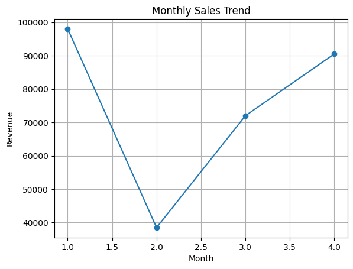
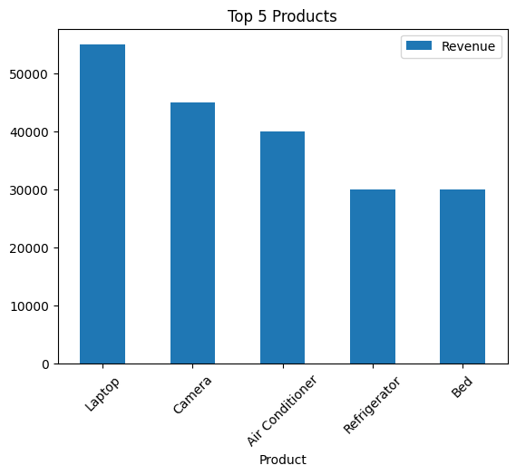
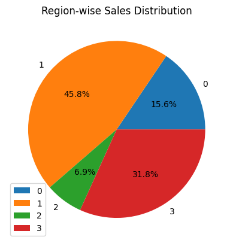

# E-commerce2
End-to-end E-commerce Sales Analysis using SQL and Python to derive business insights and visualize trends

## E-Commerce Sales Analysis (SQL + Python)

## Project Overview
This project focuses on analyzing e-commerce sales data to uncover meaningful business insights. It demonstrates the integration of SQL for data querying and Python for data processing and visualization.

## Objectives
- Analyze monthly sales trends
- Identify top-performing products
- Evaluate regional sales performance
- Understand customer purchasing patterns

## Tools & Technologies
- Python (Pandas, Matplotlib)
- SQL (SQLite)
- Google Colab

## Key Analysis Performed
- Data cleaning and transformation using Pandas
- SQL queries for revenue, product, and regional analysis
- Visualization of trends using line, bar, and pie charts

## Visualizations

## 🔍 Key Insights
- Sales show an increasing trend over time
- Electronics category contributes the highest revenue
- West region leads in overall sales performance
- High-value products drive a major portion of revenue

## Conclusion
This project showcases the ability to perform end-to-end data analysis by combining SQL and Python, simulating real-world business scenarios.

## Project Structure
- ecommerce.csv → Dataset
- analysis.ipynb → Code & visualizations
- README.md → Documentation
